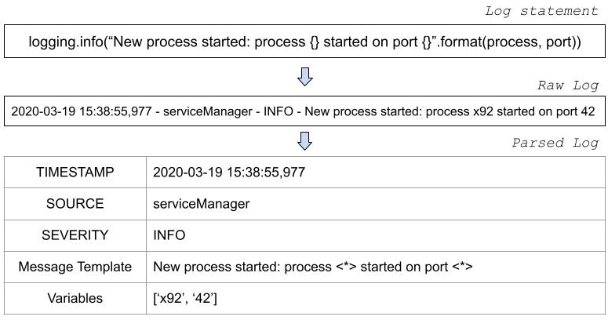

# USTEP Online Logparser

This is the code for the paper "USTEP: Unfixed Search Tree for Efficient Log Parsing" accepted at IEEE ICDM 2021.

Log parsers learn to separate variable parts of a log message from the constant ones.
USTEP is an Unfixed Search Tree for Efficient Parsing. Based on an evolving tree structure, it can discover, and encodes new parsing rules while processing log messages. 
USTEP achieves constant parsing time and can effectively parse raw log messages in a streaming manner.

This project is a fork of the [logpai/logparser](https://github.com/logpai/logparser/) repository. We add here the code of our log parsing method USTEP, and of the experience related to it.

 An illustrative example of log parsing

:telescope: If you use USTEP in your research for publication, please kindly cite the following paper.
+ [**ICDM'21**] Arthur Vervaet, Raja Chiky, Mar Callau-Zori. "USTEP: Unfixed Search Tree for Efficient Log Parsing" *International Conference on Data Mining (ICDM)*, 2021.

# Installation

The libraries needed are listed inside the requirements.txt file.

You can install them all at once by running `pip install -r requirements.txt`

# Running the Project

The main code for the parser is located inside /logparser/USTEP/ folder.

You will find a USTEP benchmark at /Benchmark/USTEP_benchmark.py

To execute it, simply run it with Python: `python /Benchmark/USTEP_benchmark.py`

If you want only want to run a demo, you can do it by running: `python /demo/USTEP_demo.py`

# Opening an Issue

For any questions or feedback, please post to [the issue page](https://github.com/ArthurVOutscale/logparser/issues).

# Contributing

No contributions accepted for this project.

# License

See [LICENSE.md](LICENSE.md) file.

# Contact us
**By mail:** publicworkloadtrace@outscale.com
